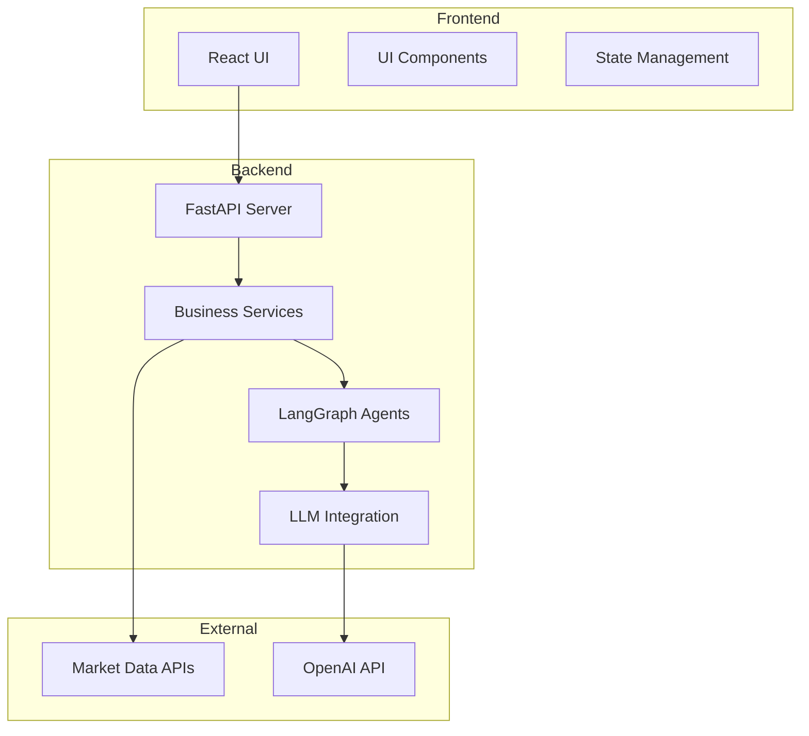
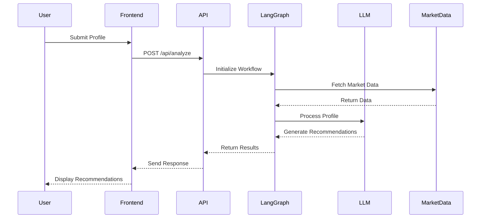
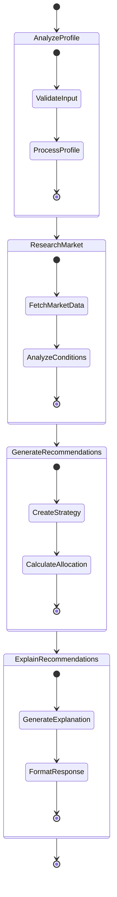
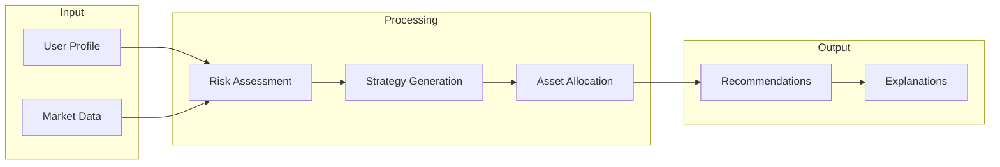
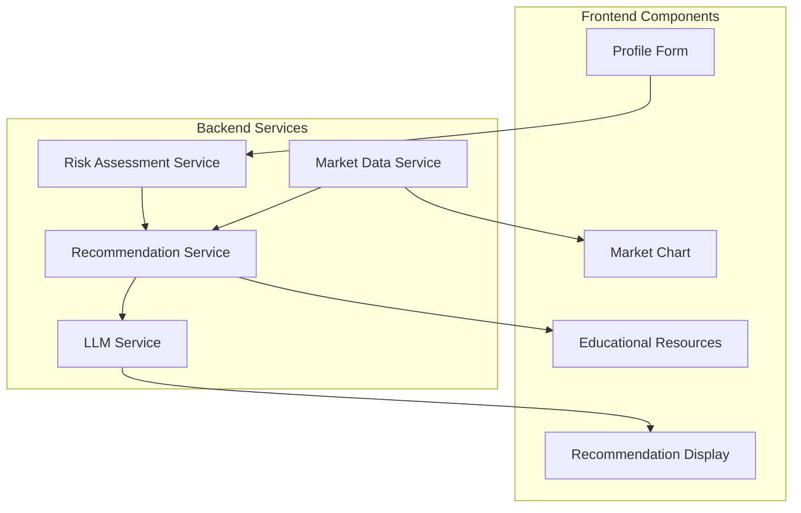
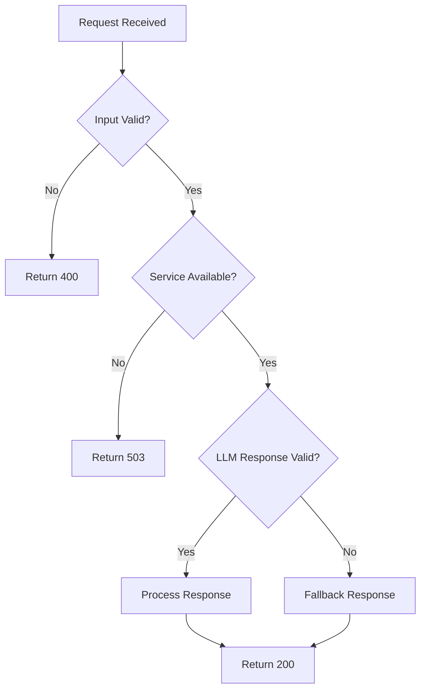
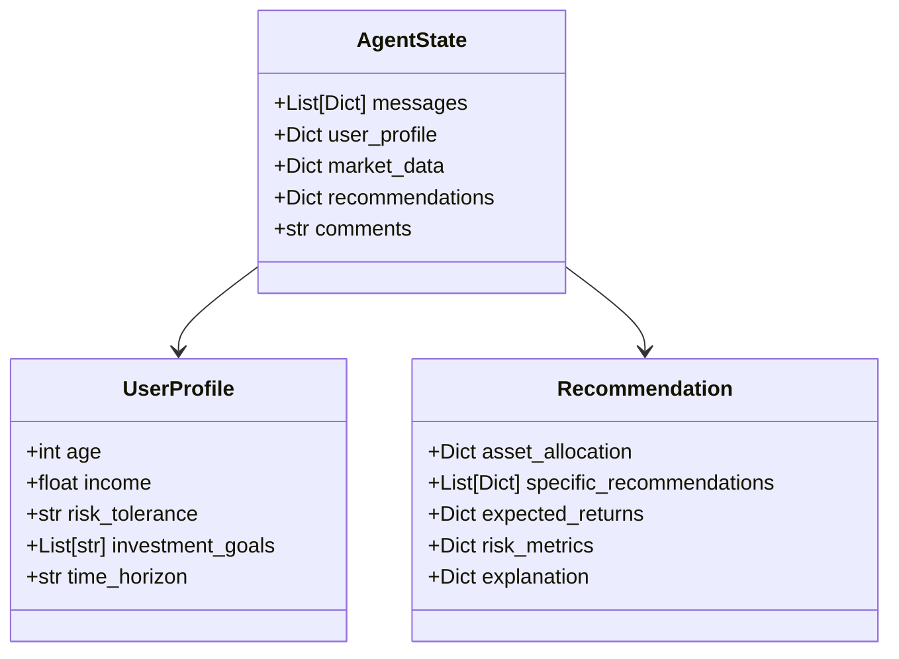
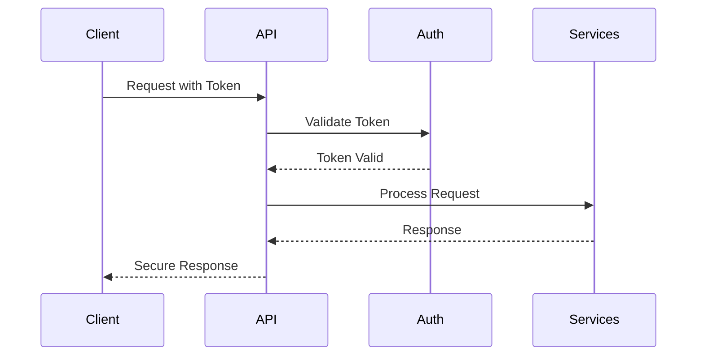
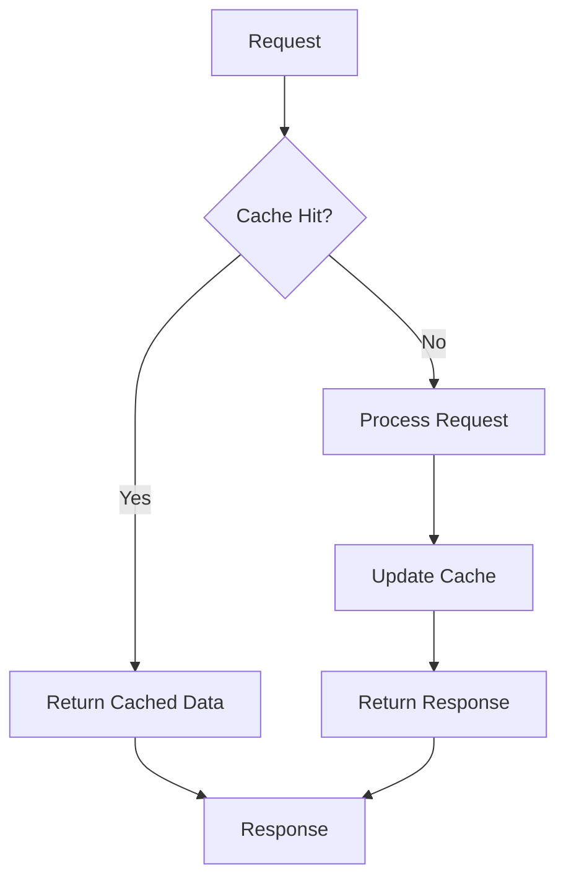

# Financial Investment Advisor Agent - Architecture Diagrams

## 1. System Architecture Overview



## 2. Request Flow Diagram



## 3. LangGraph Workflow



## 4. Data Flow Diagram



## 5. Component Interaction



## 6. Error Handling Flow



## 7. State Management



## 8. API Endpoints Structure

```mermaid
graph TD
    A[API Root] --> B[/api/analyze]
    A --> C[/api/risk-assessment]
    A --> D[/api/recommendations]
    A --> E[/api/market-data]
    
    B --> B1[POST]
    C --> C1[POST]
    D --> D1[GET]
    E --> E1[GET]
```

## 9. Security Flow



## 10. Caching Strategy



## Notes

1. **System Architecture**
   - Frontend and Backend are clearly separated
   - External services are isolated
   - Clear data flow paths

2. **Request Flow**
   - Sequential processing of user requests
   - Clear interaction between components
   - Error handling at each step

3. **LangGraph Workflow**
   - State-based processing
   - Clear transition between states
   - Modular design for each state

4. **Data Flow**
   - Clear input/output paths
   - Processing steps are well-defined
   - Data transformation points are clear

5. **Component Interaction**
   - Clear service boundaries
   - Defined communication paths
   - Modular design

6. **Error Handling**
   - Multiple validation points
   - Fallback mechanisms
   - Clear error responses

7. **State Management**
   - Clear state structure
   - Well-defined relationships
   - Type safety

8. **API Structure**
   - RESTful design
   - Clear endpoint hierarchy
   - Proper HTTP methods

9. **Security**
   - Token-based authentication
   - Secure communication
   - Service isolation

10. **Caching**
    - Performance optimization
    - Clear cache invalidation
    - Fallback mechanisms 