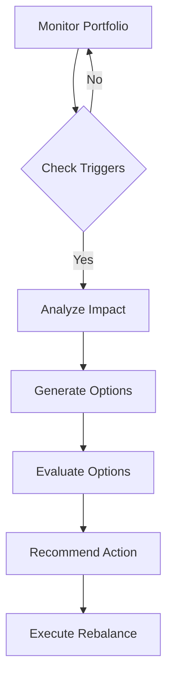

# Portfolio Monitoring and Rebalancing Feature

## Overview
The Portfolio Monitoring and Rebalancing feature provides automated, intelligent monitoring of investment portfolios and suggests rebalancing actions based on market conditions, user goals, and risk tolerance.

## Key Components

### 1. Portfolio Monitoring
- Real-time tracking of portfolio performance
- Market condition analysis
- Risk level assessment
- Goal progress tracking
- Tax implication monitoring
- Regulatory compliance checking

### 2. Rebalancing Triggers
- Asset allocation drift
- Market condition changes
- Risk level changes
- Goal timeline adjustments
- Tax optimization opportunities
- Regulatory requirement changes

### 3. Decision Making Process


## Implementation Using Agentic AI and LangGraph

### 1. State Management
```python
class PortfolioState(TypedDict):
    current_allocation: Dict[str, float]
    target_allocation: Dict[str, float]
    market_conditions: Dict[str, Any]
    risk_metrics: Dict[str, float]
    tax_implications: Dict[str, Any]
    rebalancing_history: List[Dict[str, Any]]
```

### 2. Workflow Steps
1. **Portfolio Analysis**
   - Current allocation calculation
   - Performance tracking
   - Risk assessment
   - Goal progress evaluation

2. **Market Analysis**
   - Market condition monitoring
   - Trend analysis
   - Opportunity identification
   - Risk factor assessment

3. **Rebalancing Decision**
   - Trigger evaluation
   - Impact analysis
   - Option generation
   - Recommendation creation

4. **Execution Planning**
   - Transaction planning
   - Tax optimization
   - Cost analysis
   - Timeline scheduling

### 3. Agentic AI Capabilities
- Pattern recognition in market data
- Predictive analysis of portfolio drift
- Intelligent trigger identification
- Personalized rebalancing strategies
- Natural language explanations

### 4. LangGraph Integration
```python
workflow = Graph()
workflow.add_node("monitor_portfolio", monitor_portfolio)
workflow.add_node("analyze_market", analyze_market_conditions)
workflow.add_node("evaluate_triggers", evaluate_rebalancing_triggers)
workflow.add_node("generate_recommendations", generate_rebalancing_recommendations)
workflow.add_node("plan_execution", plan_rebalancing_execution)
```

## Benefits

### 1. Automated Monitoring
- 24/7 portfolio tracking
- Real-time alert generation
- Automated analysis
- Continuous risk assessment
- Goal progress tracking

### 2. Intelligent Rebalancing
- Data-driven decisions
- Personalized strategies
- Tax-efficient execution
- Cost-effective implementation
- Goal-aligned adjustments

### 3. User Experience
- Proactive notifications
- Clear explanations
- Actionable recommendations
- Progress visualization
- Educational insights

### 4. Operational Efficiency
- Reduced manual monitoring
- Automated analysis
- Streamlined execution
- Efficient resource usage
- Scalable operations

## Technical Implementation

### 1. Data Sources
- Market data APIs
- Portfolio tracking systems
- Tax information services
- Regulatory databases
- Historical performance data

### 2. Integration Points
- Portfolio management systems
- Trading platforms
- Tax calculation services
- Reporting systems
- Notification services

### 3. Monitoring Metrics
- Asset allocation drift
- Risk level changes
- Performance metrics
- Tax implications
- Cost analysis

### 4. Rebalancing Rules
- Allocation thresholds
- Risk tolerance limits
- Tax optimization rules
- Cost efficiency criteria
- Regulatory compliance

## Security and Compliance

### 1. Data Protection
- Secure data storage
- Encrypted communications
- Access control
- Audit logging
- Data backup

### 2. Regulatory Compliance
- Trading regulations
- Tax compliance
- Reporting requirements
- Documentation standards
- Audit trails

## Future Enhancements

### 1. Advanced Analytics
- Machine learning predictions
- Pattern recognition
- Anomaly detection
- Trend analysis
- Risk modeling

### 2. Integration Capabilities
- Additional data sources
- New trading platforms
- Enhanced reporting
- Advanced visualization
- Extended APIs

### 3. User Features
- Customizable alerts
- Interactive dashboards
- Detailed analytics
- Educational content
- Mobile notifications

## Conclusion
The Portfolio Monitoring and Rebalancing feature enhances the Financial Investment Advisor system by providing:
1. Automated portfolio management
2. Intelligent rebalancing decisions
3. Proactive monitoring
4. Personalized recommendations
5. Efficient execution
6. Educational value

This feature leverages the strengths of Agentic AI and LangGraph to deliver sophisticated portfolio management capabilities while maintaining system reliability and user experience. 