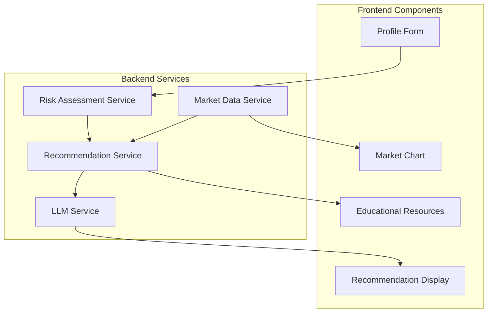

# Financial Investment Advisor Agent - System Design Document

## Table of Contents
1. [System Architecture](#1-system-architecture)
2. [Request Flow](#2-request-flow)
3. [LangGraph Workflow](#3-langgraph-workflow)
4. [Data Flow](#4-data-flow)
5. [Component Interaction](#5-component-interaction)
6. [Error Handling](#6-error-handling)
7. [State Management](#7-state-management)
8. [API Structure](#8-api-structure)
9. [Security](#9-security)
10. [Caching Strategy](#10-caching-strategy)
11. [Agentic AI & LangGraph Justification](#11-agentic-ai--langgraph-justification)

## 1. System Architecture


## 2. Request Flow


## 3. LangGraph Workflow


## 4. Data Flow


## 5. Component Interaction



## 6. Error Handling


## 7. State Management


## 8. API Structure

```mermaid
graph TD
    A[API Root] --> B[/api/analyze]
    A --> C[/api/risk-assessment]
    A --> D[/api/recommendations]
    A --> E[/api/market-data]
    
    B --> B1[POST]
    C --> C1[POST]
    D --> D1[GET]
    E --> E1[GET]
```

## 9. Security


## 10. Caching Strategy


## 11. Agentic AI & LangGraph Justification

### 11.1 Complex Decision-Making Process


### 11.2 State Management Benefits


### Key Benefits of Using Agentic AI and LangGraph

1. **Complex Financial Decision Making**
   - Multiple interconnected decisions
   - Context preservation
   - Dynamic decision adjustment
   - Backtracking capability

2. **State-Based Processing**
   - Explicit state management
   - Traceable transitions
   - Easy debugging
   - Complex workflow support

3. **Modularity and Maintainability**
   - Isolated components
   - Clear separation of concerns
   - Easy testing
   - Simplified debugging

4. **Error Handling and Recovery**
   - Built-in recovery mechanisms
   - State preservation
   - Graceful degradation
   - Clear error boundaries

5. **Scalability and Performance**
   - Parallel processing
   - Efficient state management
   - Reduced memory footprint
   - Better resource utilization

6. **Integration with LLMs**
   - Seamless LLM integration
   - Context preservation
   - Efficient prompt management
   - Better response handling

7. **Business Logic Benefits**
   - Clear business rules
   - Modifiable decision logic
   - Transparent process
   - Decision audit trail

8. **Testing and Validation**
   - Testable states
   - Clear boundaries
   - Easy mocking
   - Comprehensive coverage

9. **Monitoring and Observability**
   - Clear transitions
   - Easy logging
   - Performance metrics
   - Debug information

10. **Future Extensibility**
    - Easy feature addition
    - Clear extension points
    - Backward compatibility
    - Minimal refactoring

11. **Cost Efficiency**
    - Optimized LLM usage
    - Reduced API calls
    - Better resource utilization
    - Caching opportunities

12. **User Experience**
    - Faster responses
    - More accurate recommendations
    - Better error handling
    - Smoother user flow

### Implementation Example

```python
# LangGraph Workflow Implementation
workflow = Graph()
workflow.add_node("analyze_profile", analyze_user_profile)
workflow.add_node("research_market", research_market_conditions)
workflow.add_node("generate_recommendations", generate_recommendations)

# State Management
class AgentState(TypedDict):
    messages: List[Dict[str, str]]
    user_profile: Dict[str, Any]
    market_data: Dict[str, Any]
    recommendations: Dict[str, Any]
    comments: str

# Error Handling
def handle_error(state: AgentState, error: Exception) -> AgentState:
    state["errors"].append(str(error))
    return state
```

### Summary

The combination of Agentic AI and LangGraph provides:
1. Structured decision-making for complex financial decisions
2. Maintainable and testable code structure
3. Reliable system with robust error handling
4. Scalable architecture for future growth
5. Cost-effective resource utilization
6. Enhanced user experience

This architecture enables the system to:
- Handle complex financial decision-making
- Maintain state throughout the process
- Recover from errors gracefully
- Scale efficiently
- Provide accurate recommendations
- Deliver a superior user experience 